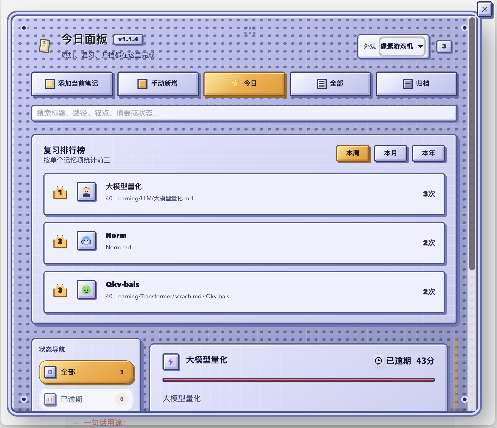
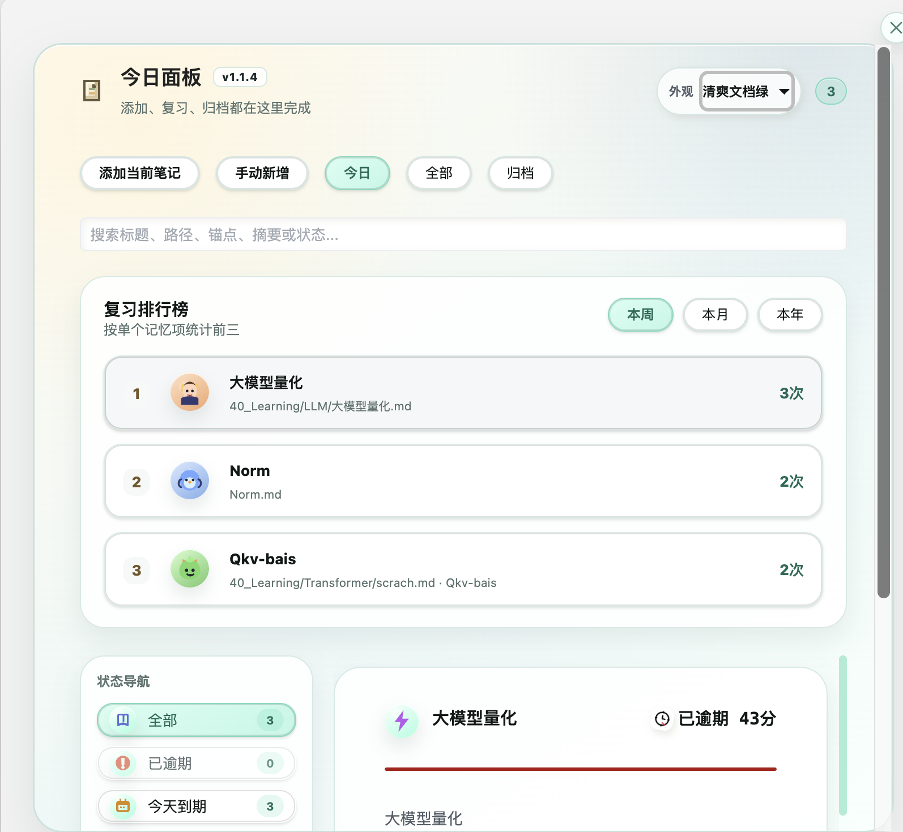
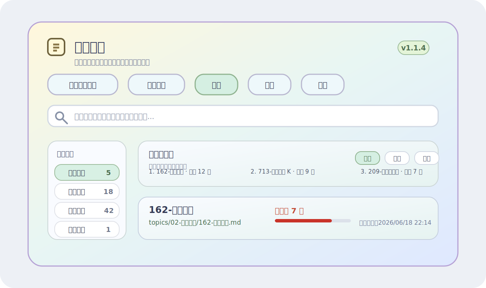
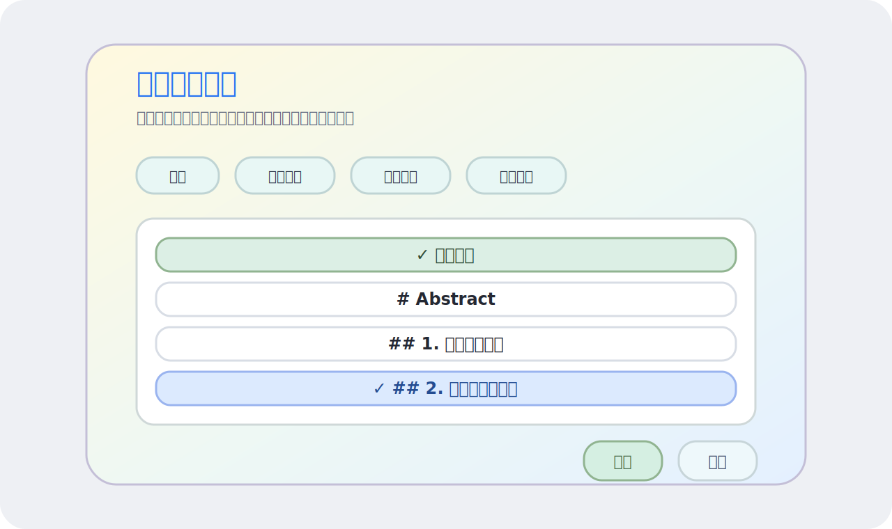
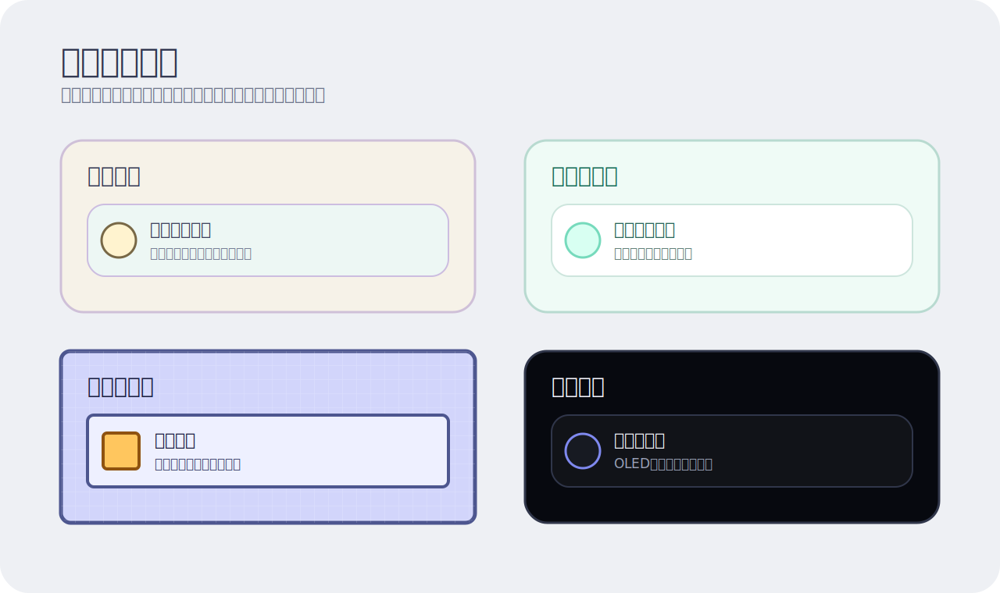
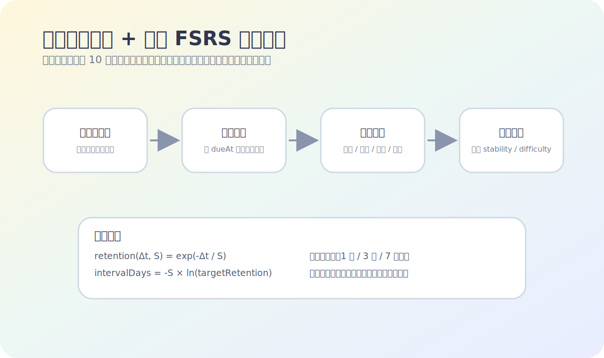

# 记忆复习调度器

一个本地优先的 Obsidian 复习调度插件。它可以把整篇笔记、一级/二级/三级标题块或手动输入内容加入复习队列，并用「艾宾浩斯遗忘曲线思想 + 简化 FSRS 动态调度」安排下一次复习。

> Local-first recall scheduler for Obsidian notes, headings, and knowledge fragments.



## Highlights

- **绑定到笔记或标题块**：支持整篇笔记，也支持绑定到 Markdown 标题范围。
- **批量添加复习范围**：可以一次选择多个标题，每个范围会分别创建记忆项。
- **动态复习调度**：根据 `忘了 / 困难 / 记得 / 简单` 调整稳定度、难度和下次间隔。
- **今日面板**：在一个弹窗里完成添加、搜索、复习、编辑、归档和恢复。
- **状态导航**：按已逾期、今天到期、未来到期、新卡、学习中、长期复习、重新学习、已归档分组。
- **排行榜**：按单个记忆项统计本周、本月、本年复习次数 Top 3。
- **多套外观**：陶瓷卡片、清爽文档绿、像素游戏机、暗色精密。
- **本地运行**：不需要后端，不上传笔记内容，不改写原始 Markdown。

## Preview

### 像素游戏机主题


### 清爽文档绿主题



### 弹窗结构总览



### 选择复习范围

点击 **添加当前笔记** 后，可以选择整篇笔记，也可以选择具体标题。多选后会为每个范围分别创建记忆项。



### 多主题弹窗

插件内置多套视觉主题，可以在设置页或弹窗顶部切换。



### 调度机制

插件不是固定间隔提醒，而是根据复习反馈动态计算下一次 `dueAt`。



## Installation

### Manual install

1. 下载或构建以下文件：
   - `manifest.json`
   - `main.js`
   - `styles.css`
2. 在你的 Vault 里创建插件目录：

```text
<Vault>/.obsidian/plugins/recall-scheduler/
```

3. 把 `manifest.json`、`main.js`、`styles.css` 放入该目录。
4. 打开 Obsidian，进入 **Settings → Community plugins**，启用 **记忆复习调度器**。

### Build from source

```bash
npm install
npm run build
```

构建完成后，复制根目录下的 `manifest.json`、`main.js`、`styles.css` 到 Obsidian 插件目录即可。

## Usage

### 添加当前笔记

1. 打开一篇 Markdown 笔记。
2. 执行命令：`添加当前笔记到复习队列`。
3. 在弹窗中选择：
   - `全部笔记`
   - 一级标题
   - 二级标题
   - 三级标题
4. 点击 **添加**。

如果选择多个标题，插件会为每个标题创建独立记忆项。

### 手动新增

执行 **打开复习弹窗**，点击 **手动新增**，可以手动填写标题、来源文件、摘要、到期时间、锚点等信息。

选择来源笔记后，也可以继续绑定到具体标题，或者保留为整篇笔记。

### 复习与反馈

每个复习项提供四个反馈按钮：

- `忘了`：降低稳定度，提高难度，进入重新学习。
- `困难`：轻微降低稳定度，缩短下次间隔。
- `记得`：提升稳定度，进入更长间隔。
- `简单`：明显提升稳定度，安排更远复习。

## Scheduling model

插件使用简化的 FSRS 风格模型：

```text
retention(Δt, S) = exp(-Δt / S)
intervalDays = -S * ln(targetRetention)
```

其中：

- `S` 是记忆稳定度 `stability`。
- `difficulty` 表示当前记忆项的难度。
- 每次复习反馈都会更新 `stability` 和 `difficulty`。
- 插件根据目标保持率反推下一次复习间隔。

默认第一次复习后的基础间隔：

| 反馈 | 下次间隔 |
| --- | --- |
| 忘了 | 1 天 |
| 困难 | 1 天 |
| 记得 | 3 天 |
| 简单 | 7 天 |

后续复习会根据当前记忆状态动态变化，不再是固定倍数。

## Review item states

复习项会按记忆状态和时间状态展示：

| 分组 | 含义 |
| --- | --- |
| 已逾期 | `dueAt` 已经过期 |
| 今天到期 | 今天需要复习 |
| 未来到期 | 之后才需要复习 |
| 新卡 | 还没有完成有效复习的新项目 |
| 学习中 | 处在早期学习阶段 |
| 长期复习 | 稳定度较高，间隔较长 |
| 重新学习 | 最近反馈为忘记，需要重新巩固 |
| 已归档 | 不再进入普通复习队列 |

## Search and duplicate handling

搜索会匹配：

- 标题
- 源路径
- 锚点标题
- 摘要
- 状态文本

重复检测规则：

- 同一源文件 + 同一复习范围完全一致时，会跳过重复创建。
- 同一笔记但不同标题范围时，会提醒，但允许创建。
- 归档项也会参与重复检测，避免误加一份完全相同的复习项。

## Moving notes

如果源笔记移动或重命名，插件会监听 Obsidian 的文件 rename 事件并自动更新复习项路径。

如果旧路径找不到，打开时还会尝试按文件指纹、文件名、标题和摘要内容做兜底匹配。只有在唯一高置信匹配时才会自动修复路径。

## Settings

插件设置包括：

- 默认外观主题
- 提醒检查间隔
- 启动时是否提示到期复习
- 是否启用桌面通知
- Notice 中最多显示多少条
- 默认文件夹

## Privacy

- 所有复习数据都通过 Obsidian 插件数据存储在本地 Vault 中。
- 插件不会上传笔记内容。
- 插件不会调用远程 API。
- 插件不会改写用户原始 Markdown 文件。

## Development

```bash
npm install
npm run dev
```

常用检查：

```bash
npm run lint
npm run build
```

本仓库还包含纯逻辑测试：

```bash
rm -rf /tmp/recall-scheduler-tests
npx tsc --target ES2021 --module commonjs --moduleResolution node --esModuleInterop --skipLibCheck \
  --outDir /tmp/recall-scheduler-tests \
  src/scheduler/*.ts src/review-helpers.ts scripts/scheduler.spec.ts scripts/review-helpers.spec.ts
node /tmp/recall-scheduler-tests/scripts/scheduler.spec.js
node /tmp/recall-scheduler-tests/scripts/review-helpers.spec.js
```

## Release artifacts

Obsidian 插件发布时需要附带：

- `manifest.json`
- `main.js`
- `styles.css`

不要把 `node_modules/`、`data.json`、`build/` 或本地 Vault 数据提交到仓库。

## License

MIT
